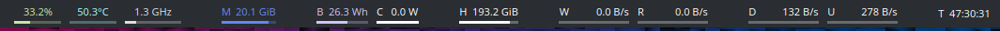
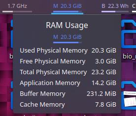
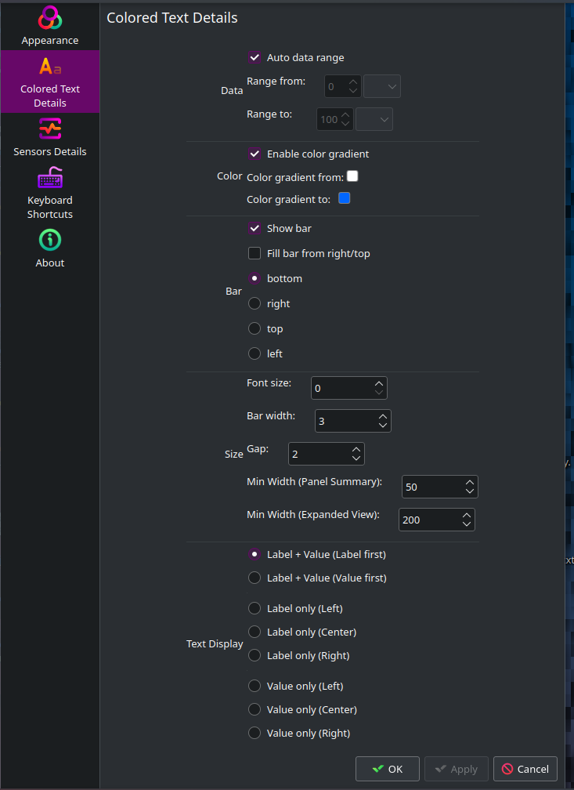

# Ksysguard Colored Text

## Overview 

This project provides a display style for Ksysguard, featuring basic data text and a bar graph that represents data percentages. The text and bars utilize gradient colors based on the data values.

Primarily designed as a sensor widget style for the **Plasma Panel**, this display style aims to offer users a clear and compact way to visualize sensor data. And this sensor style may not be suitable for use in system monitor.

## Features
Visualize system stats with a percent bar, and/or a textual label, and/or the value as text.

#### Options
1. Specify the lower and upper bounds of the statistic, or use the automatic bounds.
2. Change the color of the widget
   - The color will change following a gradient based on where within the specified bounds the value is. For a constant color, set the colors at both ends to be the same.
3. Choose the bar placement from left, right, top, bottom, or hidden. Choose bar fill direction from left/bottom to right/top, or right/top to left/bottom.
4. Configure the font size of the text, the width of the bar, and spacing between text and bar.
5. Specify the minimum width of the summary view always in the panel, and of the expanded view when clicked.
6. Configure whether the text label and/or value are shown, and their justification.

## Installation

This sensor face can be installed directly from the KDE Plasma System Monitor. Alternatively, you can manually install it by following these steps:

1. Download the appropriate display style from the [releases](https://www.pling.com/p/1972690/) page or clone this repository.
   - For plasma 5.x, download the `+plasma5` version.
   - For plasma 6.x, download the `+plasma6` version or switch to the `plasma6` branch.
2. Extract the downloaded file to `~/.local/share/ksysguard/sensorfaces/org.gerrnperl.text/`
3. Restart the `Plasma shell` and `Plasma systemmonitors` for the changes to take effect.

## Screenshots
Example showcasing various configuration options: \

Minimalist example: \

Example of the expanded view: \

Configuration menu: \
